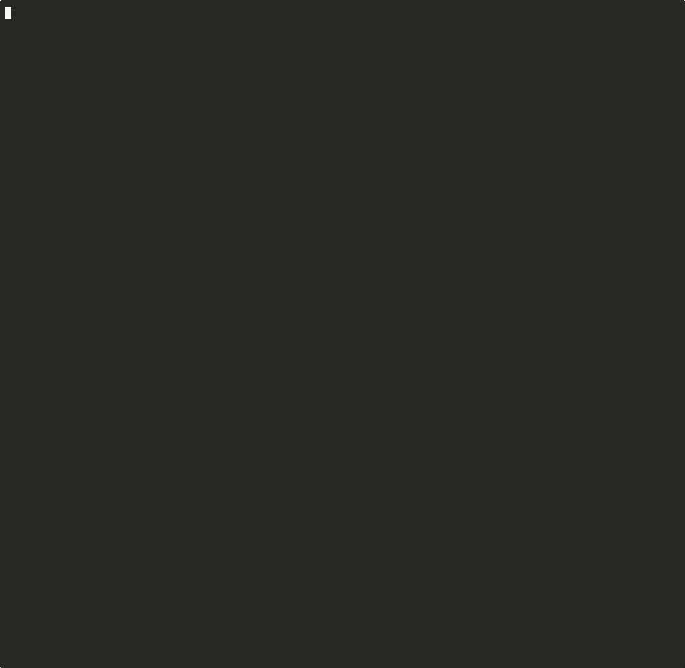

# llm-server

Smart launcher for [ik_llama.cpp](https://github.com/ikawrakow/ik_llama.cpp) and [llama.cpp](https://github.com/ggml-org/llama.cpp). Auto-detects your hardware, figures out the optimal configuration, and launches the server — no manual flag tuning required.

**Now with AI-powered self-tuning: the model optimizes its own server flags.**

**Supports Linux (NVIDIA CUDA), macOS (Apple Silicon Metal), and Windows (via WSL2).**

```bash
llm-server model.gguf
```



## What's New

- **Vision-Aware Tuning:** AI-Tune now maintains independent caches for vision-enabled runs. If `--vision` is used, the system auto-detects/downloads the necessary `mmproj` and uses a dedicated, vision-optimized configuration.
- **Stage 1 (Heuristic) + Stage 2 (Tuned) Layering:** The launcher first calculates safe heuristic placement (Expert placement for MoE, tensor splitting for Dense) as a baseline. The AI Tuner is then strictly layered on top, optimizing performance parameters while respecting these critical stability boundaries (unless `--unlimited` is requested).
- **Robust Fallback:** If `ik_llama` encounters hardware or compatibility issues, the launcher now automatically strips incompatible ik-specific flags and retries with the mainline `llama.cpp` binary.
- **Vision-Aware VRAM Budgeting:** Accurate memory estimation for the vision encoder (`mmproj`) is now performed *before* launch to prevent OOM startup crashes.

Most llm-server users leave 20-50% performance on the table because the "good enough" defaults aren't optimal for their specific hardware + model combination. `--ai-tune` fixes this:

```bash
llm-server model.gguf --ai-tune
```

The model being served proposes its own optimal flags, benchmarks each one, learns from the results, and iterates — 8 rounds of self-optimization. Crashes get free retries so every round counts. The winner is cached for instant use on every future launch.

```
Round 0/8: Benchmarking baseline (heuristic config)...
  Baseline: gen=23.17 tok/s  pp=119.87 tok/s
Round 1/8: Config: optimized_split_hadamard_v2
  Result: gen=22.05 tok/s (-4.8%)
Round 3/8: Config: optimized_tensor_split_q4
  ★ NEW BEST: gen=24.56 tok/s (+6.0%)
Round 7/8: Config: ultra_stable_3090ti_bias
  ★ NEW BEST: gen=24.77 tok/s (+6.9%)

AI Tune complete: ultra_stable_3090ti_bias wins!
  Baseline: 23.17 tok/s → Best: 24.77 tok/s (+6.9%)
```

No external API needed. No internet required. The model tunes itself using its own intelligence. Results are cached — run `--ai-tune` once, benefit forever.

| Model | Before | After | Improvement |
|---|---|---|---|
| **Qwen3.5-27B Q4_K_M** | 25.94 tok/s | 40.05 tok/s | **+54% gen** |
| **gemma-4-31B UD-Q4_K_XL** | 23.17 tok/s | 24.77 tok/s | **+6.9% gen** |

*RTX 3090 Ti + RTX 4070 + RTX 3060 (49GB total VRAM)*

### How it works

1. Launches with heuristic config → benchmarks as baseline
2. Queries the running model: "Here's my hardware, the full --help, and the baseline. Propose a better config."
3. Parses the JSON response, launches with proposed flags, benchmarks
4. Feeds results back: "That got 24.56 tok/s. Try to beat it."
5. Repeats for 8 rounds (crashes get free retries). Saves the winner to cache.
6. Next `llm-server model.gguf` → uses cached config instantly

The LLM sees every available flag, your exact GPU specs, PCIe topology, and all past tuning results. It learns across sessions — crash data, what worked, what didn't.

## Why llm-server?

Running llama.cpp on multi-GPU setups means juggling dozens of flags. llm-server figures it all out.

<table>
<tr><th>Without llm-server</th><th>With llm-server</th></tr>
<tr>
<td>

```bash
# Figure out layer count from GGUF metadata
# Calculate VRAM split for 3090Ti + 4070 + 3060
# Pick KV cache quant based on remaining headroom
# Set tensor split ratios by PCIe bandwidth
# Enable graph split mode for ik_llama
# Handle fused tensors, MoE expert placement...

llama-server \
  -m model.gguf \
  -ngl 81 \
  --ctx-size 32768 \
  --tensor-split 24,12,12 \
  --split-mode graph \
  -mg 0 \
  --cache-type-k q8_0 \
  --cache-type-v q8_0 \
  -fa on \
  --threads 8 \
  --threads-batch 16 \
  -b 4096 \
  -ub 1024 \
  --jinja \
  --run-time-repack \
  -khad \
  -defrag-thold 0.1 \
  --port 8081
```

</td>
<td>

```bash
llm-server model.gguf
```

</td>
</tr>
</table>

## Features

- **AI Self-Tuning** — `--ai-tune` lets the model optimize its own server flags. 8 rounds of iterative benchmarking (crashes get free retries, large models get OOM protection). Cached for instant reuse. Up to +54% generation speed in real tests.
- **Built-in GGUF Downloader** — Use `--download` with any HuggingFace repo. Automatically recommends the best quantization based on your total VRAM and System RAM.
- **Native Fused Support** — Full compatibility with fused `ffn_up_gate` models (e.g., AesSedai) using high-performance `ik_llama.cpp` kernels.
- **Lib Hub** — Automatically symlinks all required `.so` libraries into a temporary directory, solving library path issues.
- **Auto GPU detection** — works with 0 to 8+ GPUs, any mix of NVIDIA cards.
- **GPU selection** — `--gpus 0,1` restricts the instance to specific GPUs, enabling multi-instance usage (e.g. 397B on GPUs 0+1, small model on GPU 2).
- **RAM budget** — `--ram-budget 60G` caps RAM usage so multiple instances can coexist without OOM.
- **Split Mode Graph** — Automatically enables `-sm graph` for both `ik_llama.cpp` and mainline for superior multi-GPU scaling.
- **Heterogeneous GPU support** — different VRAM sizes, different PCIe bandwidths, properly weighted.
- **MoE expert auto-placement** — starts conservative, measures actual VRAM usage, optimizes, caches for instant next startup.
- **Vision support** — `--vision` auto-detects and downloads the correct mmproj from HuggingFace. Also works with `--mmproj auto` or a specific path.
- **Auto-update** — `--update` pulls latest ik_llama.cpp and llama.cpp, rebuilds with CUDA, and automatically rolls back if the new binary breaks.
- **Auto-fallback** — if ik_llama.cpp can't load a model (unsupported architecture), automatically switches to mainline llama.cpp mid-launch.
- **Crash recovery** — auto-restarts with backoff on runtime crashes, detects CUDA errors and image decode loops. Use `--keep-alive` (or `LLM_KEEP_ALIVE=1`) for unattended deployments that must never go offline.
- **Backend selection** — `--backend llama|ik_llama` forces a specific backend, overriding auto-detection. `llm-server-gui` exposes this as an interactive picker and remembers your choice in `~/.config/llm-server/config.sh`.
- **Long-tune support** — `--tune-long-timeout` doubles per-round timeouts during `--ai-tune` for very large / slow-loading models.
- **Benchmark mode** — `--benchmark` to measure tok/s and auto-exit after completion.
- **Terminal GUI** — `llm-server-gui` for interactive model selection with option toggles (`[a]` AI Tune, `[b]` Bench, `[v]` Vision, `[o]` OpenCode, `[d]` Dry Run, `[k]` Keep Alive).

## Install

```bash
git clone https://github.com/raketenkater/llm-server.git
cd llm-server
./install.sh
```

### Requirements

**Linux:**
- [ik_llama.cpp](https://github.com/ikawrakow/ik_llama.cpp) (recommended) or [llama.cpp](https://github.com/ggml-org/llama.cpp) built with CUDA
- `nvidia-smi` (for GPU detection)
- `python3`, `huggingface_hub`, `tqdm`, `curl`

**macOS (Apple Silicon):**
- [llama.cpp](https://github.com/ggml-org/llama.cpp) built with Metal (or `brew install llama.cpp`)
- `python3`, `huggingface_hub`, `tqdm`, `curl`

**Windows:**
- Install [WSL2](https://learn.microsoft.com/en-us/windows/wsl/install) (`wsl --install` in PowerShell)
- Inside WSL2, follow the Linux instructions above
- NVIDIA GPU passthrough works automatically in WSL2 with up-to-date drivers

## Usage

```bash
# Basic — auto-detects everything
llm-server model.gguf

# AI Tune — let the model optimize its own flags
llm-server model.gguf --ai-tune

# Re-tune — force optimization even if cached result exists
llm-server model.gguf --ai-tune --retune

# Vision — auto-downloads the matching mmproj from HuggingFace
llm-server model.gguf --vision

# Interactive Download & Recommend — specify any HuggingFace repository
llm-server unsloth/Qwen3.5-27B-GGUF --download

# Update backends — pulls, rebuilds, rolls back if broken
llm-server --update

# Force a specific backend
llm-server --backend llama model.gguf       # mainline llama.cpp
llm-server --backend ik_llama model.gguf    # ik_llama.cpp
llm-server --server-bin /path/to/llama-server model.gguf  # explicit binary path

# Unattended / always-on — never give up on restart loop
llm-server model.gguf --keep-alive

# Slow/huge model tuning — doubles per-round timeouts
llm-server huge-model.gguf --ai-tune --tune-long-timeout

# Start and run a quick benchmark (auto-exits)
llm-server --benchmark model.gguf

# Multi-instance: big model on GPUs 0+1, small model on GPU 2
llm-server big-model.gguf --gpus 0,1 --port 8081 --ram-budget 90G
llm-server small-model.gguf --gpus 2 --port 8082 --ram-budget 30G

# Terminal GUI — interactive model picker with option toggles
llm-server-gui
```

## How It Works

### AI Self-Tuning (`--ai-tune`)
The model being served acts as its own performance consultant:
1. Runs heuristic config as baseline → benchmarks
2. Sends the model its hardware profile, GGUF metadata, full `--help` output, and baseline results
3. Model proposes flag overrides as JSON → script applies them on top of the baseline, benchmarks
4. Results fed back → model proposes next config → repeat for 8 rounds
5. Crashes get free retries (up to 4). Large models (>70% system memory) get a confirmation prompt.
6. Server processes are marked as OOM-kill targets — a bad config kills the server, never your system.
7. Winner cached at `~/.cache/llm-server/` — used automatically on future launches
8. All results persisted to `tune_history.jsonl` — the model learns across sessions

No external API, no internet, no dependencies. The model tunes itself.

### The Smart Downloader
When you use `--download`, the script calculates your total available memory:
`Total = System VRAM + System RAM`
It then looks at the model repository and recommends the quantization level that will give you the best balance of speed and quality for your specific hardware.

### Vision (multimodal)
Many models support image input via a separate mmproj (multimodal projector) file. With `--vision`, llm-server:
1. Checks for an existing mmproj in the model directory
2. Verifies it matches the loaded model (e.g., won't use a Qwen mmproj for Gemma)
3. If missing or mismatched, downloads the correct `mmproj-F16.gguf` from HuggingFace automatically
4. Infers the correct HuggingFace repo from GGUF metadata (`general.basename` + `general.quantized_by`)

You can also use `--mmproj path/to/mmproj.gguf` to specify a file directly.

### Auto-update
`llm-server --update` updates ik_llama.cpp, llama.cpp backends, and llm-server itself:
1. Pulls the latest llm-server repo and re-runs `install.sh`
2. Backs up each backend's current working binary
3. `git pull` + rebuild with the existing cmake config (preserves your CUDA flags)
4. Smoke-tests the new binary
5. If the build fails or the binary crashes → rolls back to the previous commit and restores the backup

Update fearlessly — a broken upstream commit won't leave you without a working server.

### Auto-fallback
If ik_llama.cpp can't load a model (unsupported architecture), llm-server automatically:
1. Detects the load failure from the server log
2. Switches to mainline llama.cpp
3. Strips ik_llama-specific flags (graph split, checkpoints, etc.)
4. Retries the launch — no manual intervention needed

This also works via static detection: known unsupported architectures are caught before launch and routed to mainline directly.

### Native Fused Support
Modern GGUF quants often "fuse" tensors (e.g., `ffn_up_gate`) for 10-20% faster processing. While these previously caused crashes on specialized backends, `llm-server` now detects these models and enables the optimized fused kernels in `ik_llama.cpp` automatically.

## License
MIT

---
<p align="right">
  <a href="https://www.buymeacoffee.com/raketenkater">
    
  </a>
</p>
